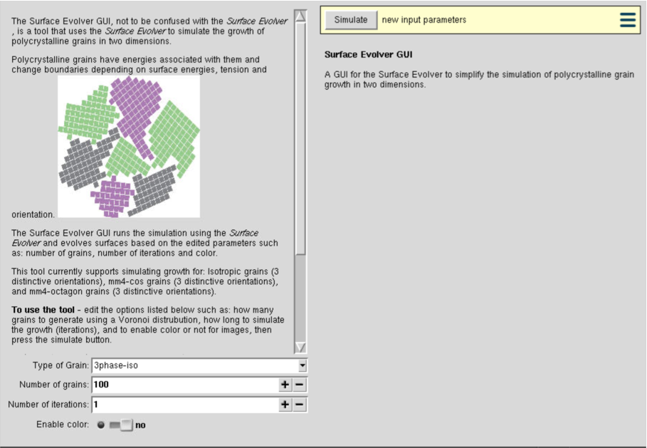
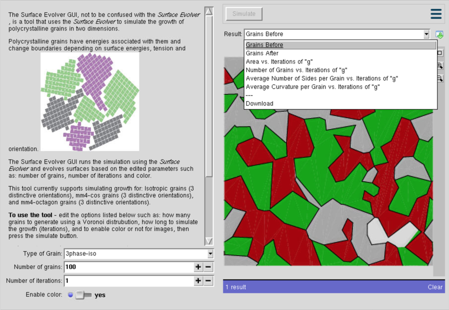

# GUI for the Surface Evolver
The *GUI for the Surface Evolver* is an online simulation tool written by Kevin Ngo in collaboration with Dr. John Blendell and Lucas Robinson at Purdue University. The original program, named *Surface Evolver*, not to be confused with the *GUI for the Surface Evolver*, is an "interactive program for the modelling of surfaces shaped by various forces and constraints" that is written by Ken Brakke. The *GUI for the Surface Evolver* is made through the *Rappture toolkit* and simplifies the process of simulating the growth of crystal grains growing in 2D by offering users an abstraction from the command line as well as a simple way to extract useful data from the simulation. *Note: This version of the src is not the most up to date, if you intend to add features, visit https://nanoHUB.org/tools/surfevolvergui and check the most updated version first*

## Getting Started
### "Installing" The Easy Way
To use the tool, you do not need to install it, simply visit https://nanoHUB.org/tools/surfevolvergui, create an account and launch the tool. *Note: If you have trouble accessing the tool after creating an account - submit a ticket to support and request to use the tool. (Remember to include the reason why you are using it!)*

### "Installing" The Hard Way
In the case that you want to run the program locally (running the Surface Evolver in some instances is computationally expensive so running the program locally often will speed up the process of simulation) or edit the source, the Rappture toolkit must be installed and it can be found at https://nanohub.org/infrastructure/rappture/wiki/rappture_install_linux. The website offers installation guides for Linux/macOS systems as well as documentation for the Rappture interface.

## Starting the *GUI for the Surface Evolver*
If you created a nanoHUB account you can simply click "Launch Tool" to use it.
If you manually installed the Rappture toolkit, clone this directory and using the shell navigate to the directory named "rappture". Once in this directory type "rappture" to run the tool. The command "rappture" will invoke the "tool.xml" file in the directory.

## Running the *GUI for the Surface Evolver*
The tool has default parameters which are simply the number of grains and if you wish to enable color or not (for the images of grains before and after).
These parameters can be changed; however, note that enabling color will slow down the speed of the simulation.

**Number of Grains**: "Number of Grains" is the number of grains that you want to start off with that is distributed accross the plane via a Voronoi Tesselation. (Default is 100 grains)

**Number of Iterations**: "Number of Iterations" is the number of times that you want the grains to grow. There are periods to the grain growth and you can specify how many iterations of "g" to run. The higher the number, the longer the simulation will run and the shape of the grains will naturally be at a lower energy-state. (Default is 1 iteration)

**Enable Color**: "Enable Color" is a toggle button that allows a user to see images of the grains in color, rather than with no color. This must be checked off or on before running the simulation and cannot be changed during the simulation. (Default is no color) *Note: Enabling color will slow down the computational speed of the simulation.*

Once you have edited these parameters to your heart's content, simly click "Simulate"!

## Features
The *GUI for the Surface Evolver* was made to simplify the process of running and studying the growth of crystal grains. To do this, there are many ways to view/download the information gathered during the simulation.
The tool offers several graphs, all of which the data or the image of the graph can be downloaded.

**Grains Before**: is a static image of the plane before running the simulation.

**Grains After**: is a static image of the plane after running the simulation.

**Area vs. Time**: is a curve representing the total area of the colored grains (in this case grains come in three different orientations, marked by color, being either: red, green or white, respect to time.

**Number of Grains vs. Time**: is a curve representing the total number of grains respect to time.

**Average Number of Sides per Grain vs. Time**: is a curve representing the average number of sides for each colored grain, respect to time.

**Average Curvature per Grain vs. Time**: is a curve representing the average energy per grain, respect to time.

To download a graph or the data points that were used to create the plot, select the graph from the drop down menu, then reopen the drop down menu and click download. It will then allow you to specify if you want a \*.txt file of the data points, or a \*.jpg file which is an image of the graph.

